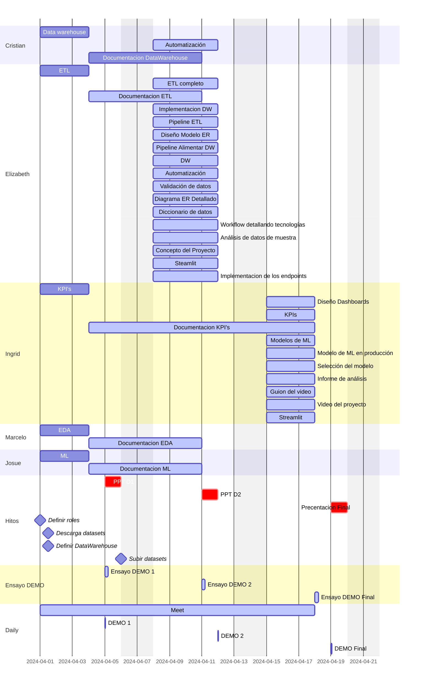

### Diagrama de gantt / organizacion de tareas

```mermaid
gantt
   
    dateFormat  YYYY-MM-DD
    excludes     saturday sunday
    %% (`excludes` accepts specific dates in YYYY-MM-DD format, days of the week ("sunday") or "weekends", but not the word "weekdays".)

    section Cristian
    
    Data warehouse            :  des4, 2024-04-01, 3d
    Automatización             :active,    des11, 2024-04-08, 4d
    Documentacion DataWarehouse       : a1, after des4, 5d
              

    section Elizabeth

    ETL                       :    des1, 2024-04-01, 3d 
    ETL completo               :active,    des6, 2024-04-08, 4d
    Documentacion ETL               :active, a1, after des1, 5d
    Implementacion DW         :active,    des7, 2024-04-08, 4d
    Pipeline ETL               :active,    des8, 2024-04-08, 4d
    Diseño Modelo ER           :active,    des8, 2024-04-08, 4d 
    Pipeline Alimentar DW       :active,    des9, 2024-04-08, 4d
    DW                          :active,    des10, 2024-04-08, 4d
    Automatización             :active,    des11, 2024-04-08, 4d
    Validación de datos         :active,    des12, 2024-04-08, 4d
    Diagrama ER Detallado       :active,    des13, 2024-04-08, 4d
    Diccionario de datos        :active,    des14, 2024-04-08, 4d
    Workflow detallando tecnologías :active,    des15, 2024-04-08, 4d
    Análisis de datos de muestra   :active,    des16, 2024-04-08, 4d
    Concepto del Proyecto         :active,    des17, 2024-04-08, 4d
    Steamlit                     :active,    des18, 2024-04-08, 4d
    Implementacion de los endpoints     :active,    des19, 2024-04-08, 4d

    section Ingrid
    KPI's                     :   des3,  2024-04-01, 3d
    Diseño Dashboards              :active,    des20, 2024-04-15, 3d
    KPIs                           :active,    des21, 2024-04-15, 3d
    Documentacion KPI's              :active, a1, after des1, 10d
    Modelos de ML                   :active,    des22, 2024-04-15, 3d
    Modelo de ML en producción      :active,    des23, 2024-04-15, 3d
    Selección del modelo         :active,    des24, 2024-04-15, 3d
    Informe de análisis               :active,    des25, 2024-04-15, 3d
    Guion del video                  :active,    des26, 2024-04-15, 3d
    Video del proyecto              :active,    des27, 2024-04-15, 3d
    Streamlit                       :active, des28, 2024-04-15, 3d


    section Marcelo
    EDA                          :  des2, 2024-04-01, 3d
    Documentacion EDA              :active, a1, after des1, 5d

   section Josue
    ML                           : des5, 2024-04-01, 3d
    Documentacion ML                   :active, a1, after des1, 5d

    section Hitos
    PPT D1                              :crit,  2024-04-05,24h
    PPT D2                              :crit,  2024-04-11,24h
    Precentacion Final                          :crit,  2024-04-19,24h
    Definir roles                       :milestone, isadded, 2024-04-01, 0d
    Descarga datasets                   :milestone, isadded, 2024-04-01, 24h
    Definir DataWarehouse               :milestone,isadded, 2024-04-01, 24h
    Subir datasets                      :milestone,isadded 2024-04-04, 2d

    section Ensayo DEMO
    Ensayo DEMO 1                       :active, 2024-04-05, 5h
    Ensayo DEMO 2                       :active, 2024-04-11, 5h
    Ensayo DEMO Final                  :active, 2024-04-18, 5h

    section Daily
    Meet                               :active,a2, 2024-04-01, 2024-04-18
    DEMO 1                             :active, 2024-04-05, 1h
    DEMO 2                             :active, 2024-04-12, 1h
    DEMO Final                             :active, 2024-04-19, 1h
   
```
