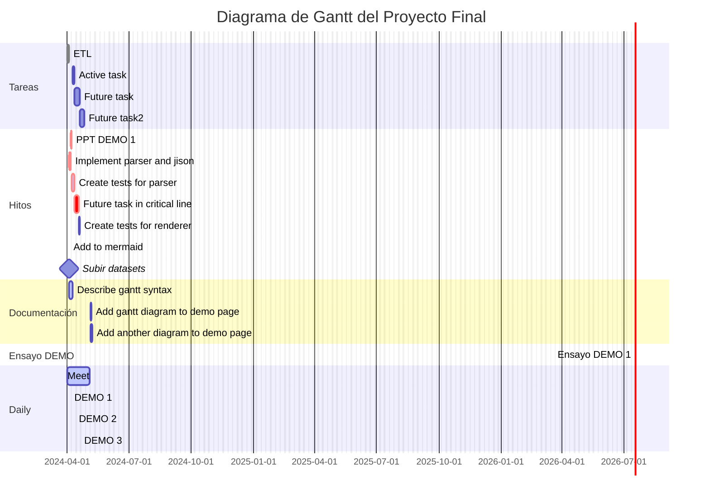
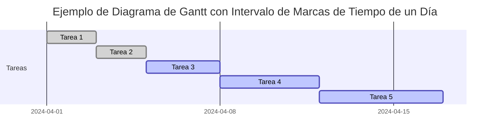

 

 

<body>
  <pre class="mermaid">
    gantt
      dateFormat  YYYY-MM-DD

      section Clickable
      Visit mermaidjs         :active, cl1, 2014-01-07, 3d
      Print arguments         :cl2, after cl1, 3d
      Print task              :cl3, after cl2, 3d

      click cl1 href "https://mermaidjs.github.io/"
      click cl2 call printArguments("test1", "test2", test3)
      click cl3 call printTask()
  </pre>

  
</body>
