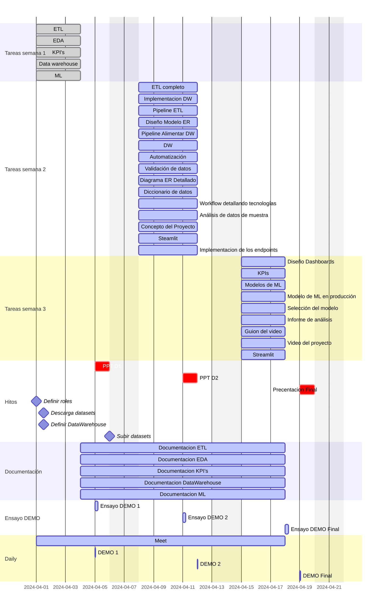

### Diccionarios de datos

| Nombre de la columna    | Descripción                                            | Tipo de dato | Tipo de variable |
|-------------------------|--------------------------------------------------------|--------------|------------------|
| Vendor ID               | Identificador de proveedor                             | int          | Cualitativa      |
| tpep_pickup_datetime    | Fecha inicio del viaje                                 | datetime     | Cuantitativa     |
| tpep_dropoff_datetime   | Fecha fin del viaje                                    | datetime     | Cuantitativa     |
| Passenger_count         | Número de pasajeros                                    | float        | Cuantitativa     |
| Trip_distance           | Distancia del viaje                                    | float        | Cuantitativa     |
| PULocationID            | Identificador de la ubicación de inicio                | int          | Cualitativa      |
| DOLocationID            | Identificador de la ubicación final                    | int          | Cualitativa      |
| RateCodeID              | Identificador de tarifa final vigente al finalizar el viaje | float   | Cualitativa      |
| Store_and_fwd_flag      | Marca de almacenamiento y reenvío                      | object       | Cualitativa      |
| Payment_type            | Forma de pago                                          | float        | Cualitativa      |
| Fare_amount             | Tarifa de tiempo y distancia calculada                 | float        | Cuantitativa     |
| Extra                   | Recargos por hora pico y por noche                    | float        | Cuantitativa     |
| MTA_tax                 | Impuesto MTA que se cobra según la tarifa              | float        | Cuantitativa     |
| Improvement_surcharge   | Recargo por mejora                                     | float        | Cuantitativa     |
| Tip_amount              | Propinas                                               | float        | Cuantitativa     |
| Tolls_amount            | Importe total de todos los peajes                      | float        | Cuantitativa     |
| Total_amount            | Importe total cobrado a los pasajeros                  | float        | Cuantitativa     |
| Trip_type               | Identifica si el viaje fue en calle o asignado         | float        | Cualitativa      |
| Congestion_Surcharge    | Monto total cobrado por congestión en NY               | float        | Cuantitativa     |

### Diagrama de gantt / organizacion de tareas

 

