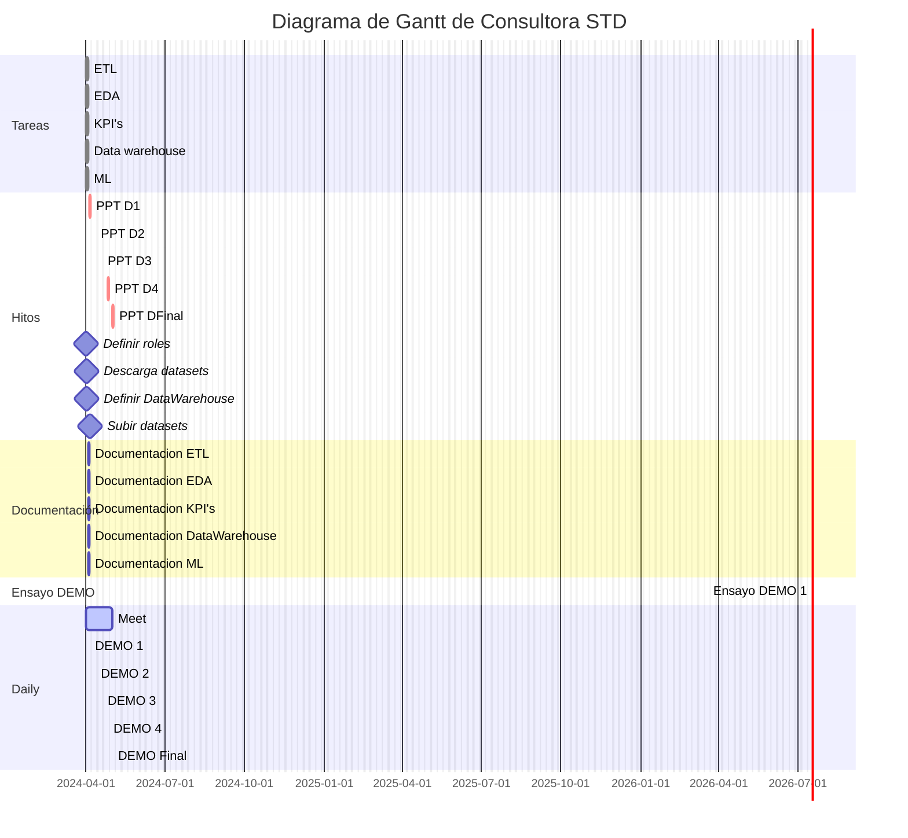

 

```mermaid
gantt
   
    dateFormat  YYYY-MM-DD
    title       Diagrama de Gantt de Consultora STD
    excludes    weekends
    %% (`excludes` accepts specific dates in YYYY-MM-DD format, days of the week ("sunday") or "weekends", but not the word "weekdays".)

   section Tareas
    ETL                       :done,    des1, 2024-04-01, 3d
    EDA                       :done,  des2, 2024-04-01, 3d
    KPI's                     :done,   des3,  2024-04-01, 3d
    Data warehouse            :done,   des4, 2024-04-01, 3d
    ML                        :done, des5, 2024-04-01, 3d               

    section Hitos
    PPT D1                              :crit,  2024-04-05,24h
    PPT D2                              :crit,  2024-04-11,24h
    PPT D3                              :crit,  2024-04-19,24h
    PPT D4                              :crit,  2024-04-26,24h
    PPT DFinal                              :crit,  after a1,24h
    Definir roles                       :milestone, isadded, 2024-04-01, 0d
    Descarga datasets                   :milestone, isadded, 2024-04-01, 24h
    Definir DataWarehouse               :milestone,isadded, 2024-04-01, 24h
    Subir datasets                      :milestone,isadded 2024-04-04, 2d

    section Documentación
    Documentacion ETL               :active, a1, after des1, 1d
    Documentacion EDA              :active, a1, after des1, 1d
    Documentacion KPI's              :active, a1, after des1, 1d
    Documentacion DataWarehouse       :active, a1, after des1, 1d
    Documentacion ML             :active, a1, after des1, 1d
    
    section Ensayo DEMO
    Ensayo DEMO 1                       :active, after 2024-04-05, 5h

    section Daily
    Meet                               :active,a1, 2024-04-01, 2024-05-02
    DEMO 1                             :active, 2024-04-05, 1h
    DEMO 2                             :active, 2024-04-12, 1h
    DEMO 3                             :active, 2024-04-19, 1h
    DEMO 4                             :active,2024-04-26, 1h
    DEMO Final                             :after a1, 1h

```

 

