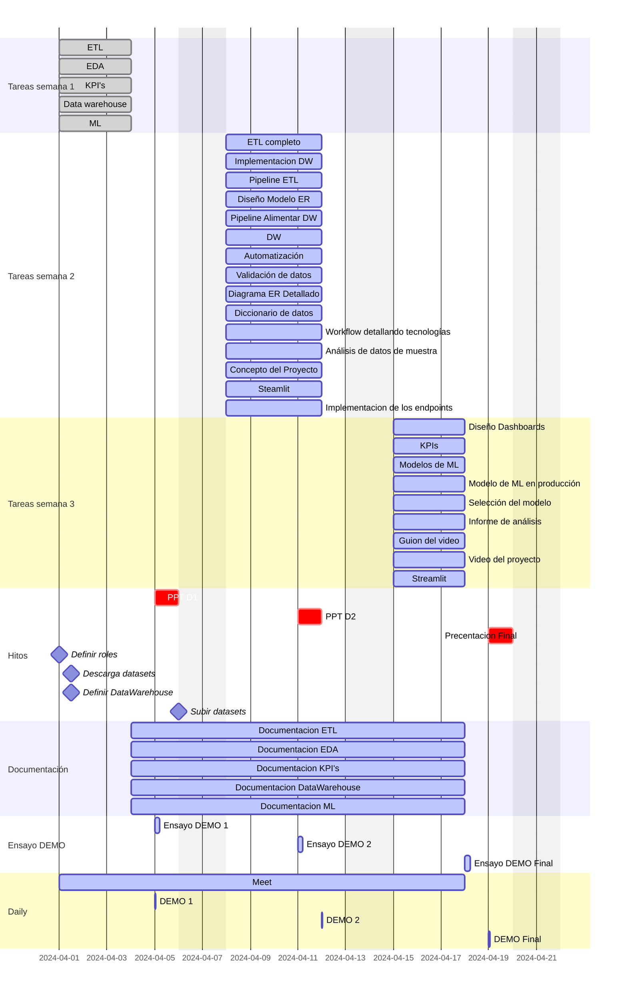

# Diccionarios de datos

## Diccionarios de datos originales

### green/yellow 2018-2021 original

| Nombre de la columna    | Descripción                                            | Tipo de dato | Tipo de variable |
|-------------------------|--------------------------------------------------------|--------------|------------------|
| Vendor ID               | Identificador de proveedor                             | int          | Cualitativa      |
| tpep_pickup_datetime    | Fecha inicio del viaje                                 | datetime     | Cuantitativa     |
| tpep_dropoff_datetime   | Fecha fin del viaje                                    | datetime     | Cuantitativa     |
| Passenger_count         | Número de pasajeros                                    | float        | Cuantitativa     |
| Trip_distance           | Distancia del viaje                                    | float        | Cuantitativa     |
| PULocationID            | Identificador de la ubicación de inicio                | int          | Cualitativa      |
| DOLocationID            | Identificador de la ubicación final                    | int          | Cualitativa      |
| RateCodeID              | Identificador de tarifa final vigente al finalizar el viaje | float   | Cualitativa      |
| Store_and_fwd_flag      | Marca de almacenamiento y reenvío                      | object       | Cualitativa      |
| Payment_type            | Forma de pago                                          | float        | Cualitativa      |
| Fare_amount             | Tarifa de tiempo y distancia calculada                 | float        | Cuantitativa     |
| Extra                   | Recargos por hora pico y por noche                     | float        | Cuantitativa     |
| MTA_tax                 | Impuesto MTA que se cobra según la tarifa              | float        | Cuantitativa     |
| Improvement_surcharge   | Recargo por mejora                                     | float        | Cuantitativa     |
| Tip_amount              | Propinas                                               | float        | Cuantitativa     |
| Tolls_amount            | Importe total de todos los peajes                      | float        | Cuantitativa     |
| Total_amount            | Importe total cobrado a los pasajeros                  | float        | Cuantitativa     |
| airport_fee             | Importe por recoger en aeropuerto                      | float        | Cualitativa      |
| Congestion_Surcharge    | Monto total cobrado por congestión en NY               | float        | Cuantitativa     |
| Trip_type               | Identifica si el viaje fue en calle o asignado         | float        | Cualitativa      |

### green/yellow 2022 - 2023 Original
| Nombre de la columna    | Descripción                                            | Tipo de dato | Tipo de variable |
|-------------------------|--------------------------------------------------------|--------------|------------------|
| Vendor ID               | Identificador de proveedor                             | int          | Cualitativa      |
| tpep_pickup_datetime    | Fecha inicio del viaje                                 | datetime     | Cuantitativa     |
| tpep_dropoff_datetime   | Fecha fin del viaje                                    | datetime     | Cuantitativa     |
| Passenger_count         | Número de pasajeros                                    | float        | Cuantitativa     |
| Trip_distance           | Distancia del viaje                                    | float        | Cuantitativa     |
| PULocationID            | Identificador de la ubicación de inicio                | int          | Cualitativa      |
| DOLocationID            | Identificador de la ubicación final                    | int          | Cualitativa      |
| RateCodeID              | Identificador de tarifa final vigente al finalizar el viaje | float   | Cualitativa      |
| Store_and_fwd_flag      | Marca de almacenamiento y reenvío                      | object       | Cualitativa      |
| Payment_type            | Forma de pago                                          | float        | Cualitativa      |
| Fare_amount             | Tarifa de tiempo y distancia calculada                 | float        | Cuantitativa     |
| Extra                   | Recargos por hora pico y por noche                    | float        | Cuantitativa     |
| MTA_tax                 | Impuesto MTA que se cobra según la tarifa              | float        | Cuantitativa     |
| Improvement_surcharge   | Recargo por mejora                                     | float        | Cuantitativa     |
| Tip_amount              | Propinas                                               | float        | Cuantitativa     |
| Tolls_amount            | Importe total de todos los pasajes                      | float        | Cuantitativa     |
| Total_amount            | Importe total cobrado a los pasajeros                  | float        | Cuantitativa     |
| airport_fee             | Importe por recoger en aeropuerto                      | float        | Cualitativa      |
| Congestion_Surcharge    | Monto total cobrado por congestión en NY               | float        | Cuantitativa     |
| Trip_type               | Identifica si el viaje fue en calle o se asignó        | float        | Cualitativa      |

## Diccionario de datos una vez que se realizó el proceso de ETL

### green/yellow enviroment 2018-2021

| Nombre de la Columna    | Descripción                        | Tipo de dato  | Tipo de variable | Renombrada | Nombre original       |
|-------------------------|------------------------------------|---------------|------------------|------------|-----------------------|
| VendorID                | Eliminada                          | -             | -                | Si         | Vendor ID             |
| anio                    | Año de viaje                       | int           | cuantitativa     | Si         | tpep_pickup_datetime  |
| mes                     | Mes de viaje                       | int           | cuantitativa     | Si         | tpep_pickup_datetime  |
| dia_inicio              | Día en que inicio el viaje         | int           | cuantitativa     | Si         | tpep_pickup_datetime  |
| hora_inicio             | Hora en que inicio el viaje        | Datetime      | cuantitativa     | Si         | tpep_pickup_datetime  |
| dia_fin                 | Día en que finalizó el viaje       | int           | cuantitativa     | Si         | tpep_dropoff_datetime |
| hora_fin                | Hora en que finalizó el viaje      | Datetime      | cuantitativa     | Si         | tpep_dropoff_datetime |
| pax                     | Número de pasajeros                | int           | cuantitativa     | Si         | Passenger_count       |
| distancia_viaje         | Distancia que se recorrió en el viaje | float      | cuantitativa     | Si         | Trip_distance         |
| ubicacion_inicio        | Ubicación en que se inició el viaje | int          | cualitativa      | Si         | PULocationID          |
| ubicación_fin           | Ubicación en que finalizó el viaje  | int          | cualitativa      | Si         | DOLocationID          |
| tipo_tarifa             | Eliminada                          | -             | -                | No         | RateCodeID            |
| conexión_servidor       | Eliminada                          | -             | -                | No         | Store_and_fwd_flag    |
| forma_pago              | Eliminada                          | -             | -                | No         | Payment_type          |
| viaje_bruto             | Eliminada                          | -             | -                | No         | Fare_amount           |
| extra                   | Eliminada                          | -             | -                | No         | Extra                 |
| impuesto_mta            | Eliminada                          | -             | -                | No         | MTA_tax               |
| cargo_mejora            | Eliminada                          | -             | -                | No         | Improvement_surcharge |
| propina                 | Eliminada                          | -             | -                | No         | Tip_amount            |
| peajes                  | Eliminada                          | -             | -                | No         | Tolls_amount          |
| monto_total             | Eliminada                          | -             | -                | No         | Total_amount          |
| tipo_inicio             | Eliminada                          | -             | -                | No         | Trip_type             |
| cargo_congestion        | Eliminada                          | -             | -                | No         | Congestion_Surcharge  |
| tipo_color              | Color de taxi                      | str           | cualitativa      | Agregada   | type_color            |
| total_tiempo            | Tiempo que duró el viaje           | str           | cuantitativa     | Agregada   | total_tiempo          |
| airport_fee             | Eliminada                          | -             | -                | No         | airport_fee           |

### greem/yellow 2022-2023

| Nombre de la Columna   | Descripción                                           | Tipo de dato | Tipo de variable | Renombrada | Nombre original       |
|------------------------|-------------------------------------------------------|--------------|------------------|------------|-----------------------|
| Vendor ID              | Eliminada                                             | -            | -                | Si         | Vendor ID             |
| anio                   | Año de viaje                                          | int          | Cuantitativa     | Si         | tpep_pickup_datetime  |
| mes                    | Mes de viaje                                          | int          | Cuantitativa     | Si         | tpep_pickup_datetime  |
| dia_inicio             | Día en que inicio el viaje                            | int          | Cuantitativa     | Si         | tpep_pickup_datetime  |
| hora_inicio            | Hora en que inicio el viaje                           | Datetime     | Cuantitativa     | Si         | tpep_pickup_datetime  |
| dia_fin                | Día en que finalizó el viaje                         | int          | Cuantitativa     | Si         | tpep_dropoff_datetime |
| hora_fin               | Hora en que finalizó el viaje                        | Datetime     | Cuantitativa     | Si         | tpep_dropoff_datetime |
| pax                    | Número de pasajeros                                  | int          | Cuantitativa     | Si         | Passenger_count       |
| distancia_viaje        | Distancia que se recorrió en el viaje                | float        | Cuantitativa     | Si         | Trip_distance         |
| ubicacion_inicio       | Ubicación en que se inició el viaje                  | int          | Cualitativa      | Si         | PULocationID          |
| ubicación_fin          | Ubicación en que finalizó el viaje                   | int          | Cualitativa      | Si         | DOLocationID          |
| tipo_tarifa            | Identificador de tarifa final vigente al finalizar el viaje | int     | Cualitativa      | Si         | RateCodeID            |
| conexión_servidor      | -                                                     | str          | Cualitativa      | Si         | Store_and_fwd_flag    |
| forma_pago             | Forma de pago                                         | int          | Cualitativa      | Si         | Payment_type          |
| viaje_bruto            | Tarifa de tiempo y distancia calculada               | float        | Cuantitativa     | Si         | Fare_amount           |
| extra                  | Recargos por hora pico y por noche                   | float        | Cuantitativa     | Si         | Extra                 |
| impuesto_mta           | Impuesto MTA que se cobra según la tarifa            | float        | Cuantitativa     | Si         | MTA_tax               |
| cargo_mejora           | Recargo por mejora                                   | float        | Cuantitativa     | Si         | Improvement_surcharge |
| propina                | Propinas                                              | float        | Cuantitativa     | Si         | Tip_amount            |
| peajes                 | Importe total de todos los pasajes                   | float        | Cuantitativa     | Si         | Tolls_amount          |
| monto_total            | Importe total cobrado a los pasajeros                | float        | Cuantitativa     | Si         | Total_amount          |
| tipo_inicio            | Identifica si el viaje fue en calle o se asignó      | int          | Cuantitativa     | Si         | Trip_type             |
| cargo_congestion       | Monto total cobrado por congestión en NY             | float        | Cuantitativa     | Si         | Congestion_Surcharge  |
| cargo_aeropuerto       | Importe por recoger en aeropuerto                    | float        | Cuantitativa     | Si         | Airport_fee           |
| tipo_color             | Asigna el color del taxi                             | str          | Cualitativa      | Agregada   | type_color            |
| total_tiempo           | Tiempo que duró el viaje                             | -            | Cuantitativa     | Agregada   | total_tiempo          |

### Diagrama de gantt / organizacion de tareas

 

