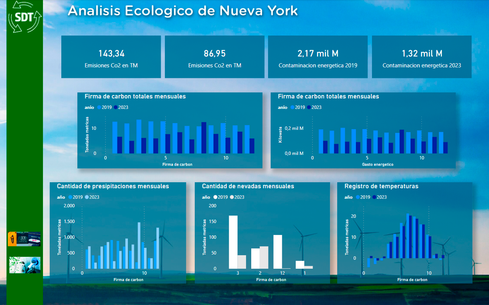
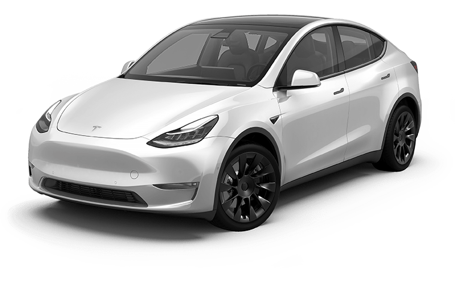

<h1><b>Stack Tecnologico</h1>

 
<h3>Estamos al corriente de las ultimas tecnologias para analisis de dato y creacion de modelos de entrenamiento de Machine Learning, para poder predecir el comportamiento de datos y asi llegar a las conclusiones pedidas por nuestro cliente, </h3>
 
 

<h1><b>Camino del dato</h1>

 

<h3>De igual manera que sobre nuestras tecnologias, queremos que nuestro cliente este al tanto de como son tratados los datos, para asi tener una mejor comprension del trabajo realizado </h3>

 
 

<h1>Explicacion del negocio de transporte en NYC
</h1>

<h3>
La ciudad de Nueva York, para poder controlar el ingreso del trafico a ciertas zonas, ideo el plan de cobrar cargos de congestion, como ya se hizo anteriormente en la ciudad de Londres, de esta manera el impacto ambiental pueda ser reducido, incentivando a la gente a tomar medios de transporte publico para acceder al centro de la ciudad.</h3>
<h3>Ademas, se establecio que para los ingresos a la ciudad atravez de la red de tuneles y puentes: 
➔	Queensboro Bridge 
➔	Manhattan Bridge 
➔	Brooklyn Bridge. 
➔	Queens Tunnel. 
➔	Abraham Lincoln Tunnel 
➔	Holland Tunnel. 

  

 

El cobro de peajes, estos solo aplican a los túneles, no así a los puentes de acceso a la ciudad dentro de la zona de congestión, hay otros puentes con peaje pero no se toman en consideración de momento, estos peajes solo existen en sentido a Manhattan, no asi a New Jersey, que esta libre de cargos. 
Estas son las tarifas que se manejan: 
</h3>

  

 
<h3>
Esta Zona, llamada Congestion zone, se limita desde la calle 60 que es el borde de Central Park, hasta la punta del Downtown Manhattan, en esta zona ademas, se regula que ciertos transportes puedan operar, en este caso, Buses de la MTA, Taxis Amarillos, Uber y Lyft. 
Un caso especial es el de los Taxis Verdes que ingresa poco a la zona de congestión ya que solo puede dejar pasajeros y no recogerlos en la calle, solo si es pedido por teléfono con anterioridad al viaje, rige la misma restricción en los aeropuertos del Tri state (Manhattan, Queens y Brooklyn). 
Los antes mencionados tienen libertad de rocojer y dejar en toda las zonas, ademas, estos son los que estan sujetos a la nueva Ley de reduccion de Co2, que para el 2030, tiene que reducirse un 40% y para el 2050 un 80%. 
Para esto tambien hicimos un analisis ambiental, que nos muestre en comparativa el año 2019 y el 2023, 
</h3>

  

 
<h3>Como podemos observar, la firma de Co2 per-capita, disminuyo desde el 2019 al 2023, Esto en parte a promover el uso de vehiculos hibridos y electricos, la Alcaldia de Nueva York, lanzo un plan para poder hacer accesible puntos de carga en todo el Tri-State Area, esto gracias al trabajo en conjunto con diferentes proovedores, siendo el mas grande, Tesla, con su red de cargadores rapidos y super cargadores, que completan una carga en tan solo 30 minutos, de esta manera se quiere lograr llegar a el objetivo para el 2030. 
Aca dejamos una muestra de la red de cargadores disponibles en la ciudad.
</h3>
 

  

 

<h1><b>Costos de inversión y renovación</h1>

<h3>
En este apartado, analizamos los costos segun 4 criterios, tipo de combustible, autonomia y disponibilidad de recarga de electrica y por tipo de vehiculo (SUV, MINI-VAN, SUV). Se calcula tomando hasta 30 unidades por modelo como para poder comenzar a operar.
Segun las nuevas Legislaciones Nueva York no admite vehiculos a nafta dentro de la zona de congestion, al menos en lo que es transporte publico, y para 2030 directamente deben ser 100% electricos.
Por lo tanto vamos a presentar los vehiculos hibridos y electricos, con la exepcion de 2 mini-vans para el transporte de mas de 4 pasajeros.
Todos los vehiculos listados estan aprobados por la ciudad de Nueva York para transporte de pasajeros.
</h3>

  

 

<h3> Gracias a nuestra calculadora que se encuentra en <a href="https://mockupapp.streamlit.app/">Streamlit</a> podemos analizar y hacer conclusiones respecto a los modelos que creemos son las mejores opciones, estan invitados a visitar nuestra pagina de Streamlit y analizar otras opciones ademas de ver mas sobre nuestra propuesta y quienes somos.
</h3>

<h1>Nafta</h1>

<h3>Estos son los casos exepcionales que hablamos respecto a vehiculos a nafta y sin las mini vans de 7 pasajeros, dada la experiencia de nuestr cliente en el transporte de pasajeros, es logico que acapare este pedazo del negocio, principalmente para viajes desde y hacia los aeropuertos JFK y La Guardia. </h3>
<h2>Vehiculo elegido para el segmento de 7 pasajeros
</h2>
 

        

            
                        
                
                
Ford Transit Connect   Costo por unidad = $35,995.00   Costo de flota = $1,079,850.00  Autonomia = 24 MPG en ciudad Tipo de vehiculo = Mini-Van 

            

        

    

<h3>Tomando en cuenta los numeros, aconsejamos la compra de la Ford Transit Connect para el segmento de 7 pasajeros, no solo por su valor, sino por la disponibilidad de cerntros de servicio y disponibilidad de repuestos para los mantenimientos regulares, menores tiempos de reparacion, dado que muchos mecanicos tienen mas familiaridad con la marca.
</h3>
 
<h1>Hibridos</h1>

        

            
                        
                
                
Kia Niro Plug-In Hybrid   Costo por unidad = $35,165.00   Costo de flota = $1,054,950.00  Autonomia = 53 MPG en ciudad Tipo de vehiculo = SUV

            

        

    

 
<h3>Tomamos en cuenta este SUV debido a su largo alcance y bajo costo de compra, teniendo una buena red de distribudores en el pais y simpleza mecanica, ademas al ser un hibrido enchufable, puede ahorrar costos de combustible por encima de los costos de carga electrica que son mas economicos, ademas de la autogeneracion electrica que genera el motor de combustible y frenos regenerativos, Ideal para viajes de ciudad o de aeropuertos con valijas medianas a grandes, gracias a su gran volumen de carga.
</h3>

        

            
                        
                
                
Honda Accord Hibryd   Costo por unidad = $28,990.00   Costo de flota = $869,700.00  Autonomia = 29 MPG en ciudad Tipo de vehiculo = Sedan

            

        

    

<h3>El Honda Accord, es la mejor eleccion ya que tiene un buen balance precio-calidad, al igual que Toyota, la calidad y durabilidad de Honda es probada desde hace muchos años, ideal para todo tipo de viajes y mas aun en ciudad.
</h3>

        

            
                        
                
                
Toyota Sienna Hibryd  Costo por unidad = $ 39,080.00
                   Costo de flota = $1,172,400.00  Autonomia = 35 MPG en ciudad Tipo de vehiculo = Mini-Van

            

        

    

<h3>El creador de los vehiculos Hibridos, Toyota, en este caso elegimos el Sienna, por que es el mas vendido en Nueva York para el transporte de pasajeros, en su version convencional tanto como la convertida para accesibilidad (sillas de ruedas), con un precio accesible y una buena autonomia, lo que lo hace ideal para el mercado de 7 pasajeros.
</h3>

<h1>Electricos</h1>
 

        

            
                        
                
                
Tesla Model 3 LR  Costo por unidad = $ 46,520.00
                   Costo de flota = $1,395,600.00  Autonomia = 134 MPG en ciudad Tipo de vehiculo = Sedan

            

        

    

 
<h3>En la actualidad Tesla tiene la red de cargadores y supercargadores mas grande de la ciudad, pudiendo estos, en el tiempo que le lleva al chofer un almuerzo, cargar del 10% al 80% en tan solo 30 minutos, Permitiendole grandes alcances con esta carga, Elegimos el Model 3 por encima de las otras opciones, por su simpleza y autonmia, claramente los costos son mas elevados que vehiculos hibridos, pero, trae ventajas a la hora de pagar cargos de congestion y peajes, ya que tiene valores menores, lo que abarata los costes de viajes, ideal para todos los viajes dentro de la ciudad como de aeropuertos, no siendo la mejor opcion para viajes de mas larga distancia, pero para eso recomendamos vehiculos hibridos, dentro de la categoria, es la mejor opcion
</h3>
 

        

            
                        
                
                
Tesla Model Y LR  Costo por unidad = $ 49,630.00
                   Costo de flota = $1,488,900.00  Autonomia = 129 MPG en ciudad Tipo de vehiculo = SUV

            

        

    

 
<h3>Elegimos el Model Y ya que dentro de la categoria de SUV, es la mejor opcion, muy cerca se encuentra la Toyota bZ4X, pero es inferior en cuestiones de alcance y por un precio similar, preferimos recomendar la Tesla, en este caso particular, es una SUV mas probada que la Japonesa y al ser de fabricacion nacional, es mas simple acceder al servicio mecanico.
</h3>
  
<h1>Tiempo de recuperación de inversión</h1>
 
<h3>Tomando en cuenta que a la fecha el Chase Bank of Manhattan Esta manejando una tasa de interes del 30%, creemos que en un año facilmente se puede recuperar la inversion, tomando en cuenta  2 modelos de Tesla y la Mini-Van hibrida, llegamos al total de:
 
$4,056,900.00 + 30% interes anual = $5,273,970.00 
Plan de 12 pagos de $439,497.50 
Pasaje promedio que cobra Grayhound en sus buses = $25 a 30 pasajes por bus = $750 costos incluidos 
$750 por bus en 600 viajes, pueden cubrir la cuota mensual, recordemos que tienen 1250 viajes diarios 
 
Solamente de lo que produce Greyhound en un dia, puede hacerle frente a los costos de insercion al mercado y esto tomando en cuenta que utilicen un prestamo para poder tener cuentas mas liquidas mensualmente, tranquilamente, podrian hacer las compras en un solo pago y asi y todo puede recuperarse en dos meses.
 
Ahora, si el negocio se va a recuperar por si mismo, pidiendo el mismo prestamo, pero utilizando las ganancias de los autos mismos, podemos usar nuestro dashboard para poder saber que ganancia mensual aproximada se esta generando y segun que modelo de negocio se elija para poder explotar el mercado. 
Nuevamente los invitamos a visitar nuestro <a href="https://mockupapp.streamlit.app/">Streamlit</a> y poder utilizar nuesro Dashboard para poder ver los analisis que tomamos asi pueden tambien sacar sus propias conclusiones.
</h3>
 

  

 

 
<h3>
$4,056,900.00 + 30% interes anual = $5,273,970.00 
Plan de 12 pagos de $439,497.50 
Sueldo promedio de un chofer mensual = $1200.00 
Ganancia bruta mensual promedio sin descontar gastos x 35 viajes diarios = $916,000.00 
Cargas electricas completas = $13.45  
3 cargas diarias = $40.35 
Total mensual x vehiculo = $1250.00 
Total mensual de la flota de 60 vehiculos electricos = $72,000.00 
Sueldos 120 Choferes cubriendo dos turnos = $144,000.00 
Total de ganancia = $259,253.00 
 
</h3>
<h1>Conclusiones
</h1>
<h3>
Segun estos calculos, creemos que es absolutamente viable la insercion al mercado de parte de Greyhound al mercado de vehiculos, si bien la recuperacion de capital seria en un plazo de un año, luego puede registrar ganancias de hasta los $700,000.00 mensuales minimamente, el mercado puede cambiar e inclusive segun los meses del año y los puntos a los que apueste la empresa, obtener ganancias de cerca del millon de dolares 
</h3>
<h1>Recomendaciones
</h1>
<h3>
Una segunda propuesta para la reduccion de costos, seria, tercerizar los vehiculos, invitando a choferes con sus vehiculos particulares, siempre y en tanto respeten la lista de vehiculos aprobados, a que se sumen a la empresa y puedan realizar viajes, estos pagando una comision determinada. 
Una tercera opcion, es proveer los vehiculos a choferes, estos pudiendo optar, por la compra a la empresa de estos vehiculos en cuotas, haciendo un sistema hibrido, donde la empresa y los choferes tienen autos propios. 
Tambien incentivamos a la empresa, la creacion de una aplicacion de Ride-Share como Uber/Lyft, simplemente llamada Greyhound-Ride, donde pueda competir con las mencionadas y ademas pudiendo obtener descuentos por ya ser pasajeros de bus. Ej: Un pasjero llega a la terminal de la calle 8 y al solicitar un viaje en la app, poniendo el numero de pasaje, obtiene el descuento. 
Ademas, se puede vender paquetes, que incluyan el pasaje de bus + el auto con servicio desde su punto de partida al hotel o domicilio del pasajero directo, sin tener que solicitarlo aparte.
</h3>

