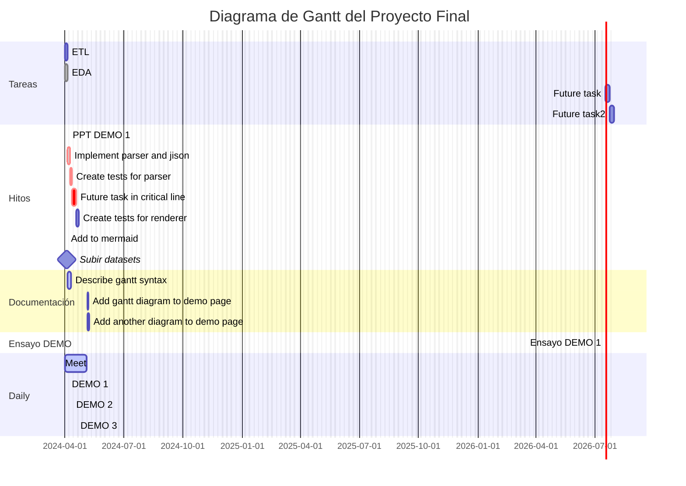
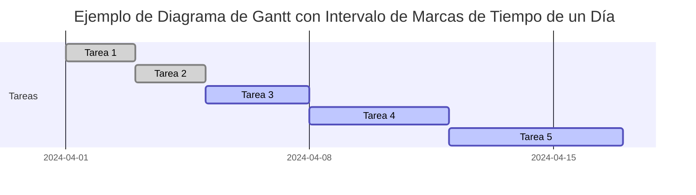

 

```mermaid
gantt
   
    dateFormat  YYYY-MM-DD
    title       Diagrama de Gantt del Proyecto Final
    excludes    weekends
    %% (`excludes` accepts specific dates in YYYY-MM-DD format, days of the week ("sunday") or "weekends", but not the word "weekdays".)

    section Tareas
    ETL                       :done   des1, 2024-04-01,4d
    EDA                       :done,  des1, 2024-04-01,4d
    Future task               :         des3, after des2, 5d
    Future task2              :         des4, after des3, 5d

    section Hitos
    PPT DEMO 1                          :crit, done, 2024-04-06,24h
    Implement parser and jison          :crit, done, after des1, 2d
    Create tests for parser             :crit, active, 3d
    Future task in critical line        :crit, 5d
    Create tests for renderer           :2d
    Add to mermaid                      :until isadded
    Subir datasets                      :milestone, isadded, 2024-04-04, 0d

    section Documentación
    Describe gantt syntax               :active, a1, after des1, 3d
    Add gantt diagram to demo page      :after a1  , 20h
    Add another diagram to demo page    :doc1, after a1  , 48h

    section Ensayo DEMO
    Ensayo DEMO 1                       :done, after 2024-04-05, 0d

    section Daily
    Meet                               :active, a1, 2024-04-01, 25d
    DEMO 1                             :after a1, 2024-04-05, 0d
    DEMO 2                             :after Meet, 2024-04-12, 0d
    DEMO 3                             :after DEMO 2, 2024-04-19, 0d

```

 

```mermaid
gantt
    dateFormat HH:mm
    axisFormat %H:%M
    Definir roles milestone : milestone, m1, 17:49, 2m
    Task A : 10m
    Task B : 5m
    Final milestone : milestone, m2, 18:08, 4m

```

 

```mermaid
gantt
    
    tickInterval 1week
    weekday monday

    dateFormat  YYYY-MM-DD
    title       Ejemplo de Diagrama de Gantt con Intervalo de Marcas de Tiempo de un Día

    section Tareas
    Tarea 1      :done, task1, 2024-04-01, 2024-04-03
    Tarea 2      :done, task2, after task1, 2d
    Tarea 3      :active, task3, after task2, 3d
    Tarea 4      :active, task4, after task3, 4d
    Tarea 5      :active, task5, after task4, 5d

```

