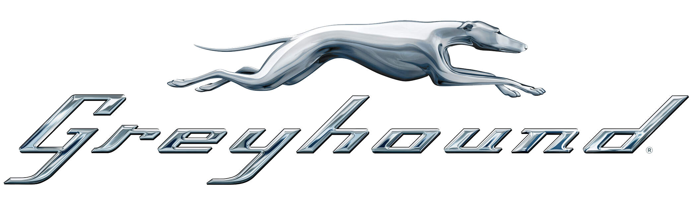

# <h1 align="center"> **NYC Autos Greyhound**   Proyecto Final </h1>

## ¿Quiénes Somos?

Somos **Strategic Data Transform**, una consultora empresarial, que presta servicios de consultoría tecnológica en el área de Data Science a empresas que quieran cumplir sus objetivos de éxito a partir de los datos.

## Objetivo del Proyecto 

El proyecto esta orientado a realizar un estudio de viabilidad para nuestro cliente Greyhound, quién se encuentra laborando en el sector del transporte con micros de media y larga distancia, y ahora quiere incursionar en el sector de trasnporte de pasajeros en la ciudad de Nueva York con autos que tengan un bajo impacto ambietal.

Greyhound quiere determinar que tipo de vehículo es el más óptimo para cada destino de viaje y asimismo contar con un estudio que le muestre si la viabilidad de realizar el proyecto con sus requerimientos es positiva, lo que conlleva a que nosotros como consultora hagamos diversos análisis de rentabilidad, impacto ambiental y viabilidad en el mercado. 
En este proyecto también se analizará el comportamiento frente a sus competidores directos (Taxis, Uber y Lyft) en la ciudad, lo cual brindará un contexto de análisis mucho más completo y amplio. 

Para poder realizar el estudio se tomo como fuente de datos la siguiente página web: [Taxi & Limousine Commission](https://www.nyc.gov/site/tlc/index.page)

Este proyecto consta de tres fases principales que se realizan implementando métodologías ágiles como Scrum, realizando reuniones diarias con el Product Manager para debatir los avances y reuniones semanales con el Product Owner para mostrar los entregables a cada fecha. Estas fases se cumplen gracias al equipo de trabajo conformado en los siguientes roles por:

- Cristian Fontanilla - Data Engineer
- Elizabeth Torres - Data Engineer
- Ingrid Barrios - Data Analyst
- Marcelo Yuba - Data Analyst
- Josue Mora - Data Scientist

Así que a continuación se repasará que conlleva cada fase o sprint del proyecto.

## **Sprint 1**

En este primer sprint se hace el planteamiento del proyecto entendiendo la situación actual realizando un EDA preliminar, se plantean los obejtivos general y específicos, el alcance del proyecto, se determianan los KPIs y las métricas a utilizar. 

También se plantea el stack tecnológico a utilizar a lo largo del proyecto, con el debido cronograma en un diagrama de Gantt y las tareas delegadas para los diferentes roles y sus metodologías.

### Objetivo General del Proyecto
Estudiar la viabilidad de incorporar vehículos eléctricos de transporte de pasajeros en la ciudad de Nueva York, con el fin de reducir la contaminación, de manera que sea rentable para la empresa, precisando la concentración en la demanda de los tipos de vehículos en las diferentes áreas de la ciudad.

En este primer sprint se plantearon los siguientes KPIs:
 
**-Para la viabilidad se propone:**

**- Eficiencia operativa: Distancia recorrida por periodo de tiempo**
Midiendo la distancia recorrida por los autos estudiados, podremos ver el comportamiento operativo, si aumenta o reduce la operación, así como también se puede ver que tanta es la acogida en el mercado.
Este KPI es un indicativo de la viabilidad del proyecto, ya que a más distancia de actividad va a ser más sostenible el negocio en el tiempo.

**Para la contaminación o impacto ambiental se propone:**

**- Emisiones de CO2**
Podemos medir el impacto en la calidad del aire de los autos con los que operará Greyhound midiendo las emisiones de CO2, donde se pueden hacer análisis comparando las emisiones de los vehículos tradicionales de combustión interna, en periodos de tiempo diferentes.
Este KPI se formula alineado con las prioridades del cliente de querer tener un menor impacto ambiental.

**Para la aceptación en el mercado se propone medir:**

**- Utilización de vehículos eléctricos por zonas: cantiad de viajes por zona**
Medir la utilización de los vehículos eléctricos y observar su comportamiento a través del tiempo, nos ayuda a identificar patrones de preferencia de estos vehículos en las diferentes zonas de la ciudad. 
Con este KPI podemos plantear una meta de aumento en la utilización por periodo de tiempo, teniendo en cuenta la cantidad de viajes realizados totales en determinada zona.

## La definición del stack tecnológico se puede ver aquí.

## **Sprint 2**

En esta segunda fase se organiza la infraestructura del proyecto con almacenamiento en la nube, desarrollando el pipeline completo para realizar el proceso de ETL automatizado, mediante **Google Cloud Plataform**.

Para lograr esto, se plantea un workflow desde el almacenamiento de los datos en el storage, creando un *bucket* de almacenamiento que reciban los datos cargados mediante *webscrapping*.

Seguido del esto, se crean **Cloud Functions** con los scripts que hacen el ETL, para que cada vez que se cargue un archivo en el storage se active la cloud function para que realice el proceso de ETL automatizado, y una vez hecho el ETL se activa otra cloud function para enviar el dataset ya transformado y limpio a **BigQuery**.

Una vez esté almacenado el dataset limpio en BigQuery, estará disponible para hacer las consultas que se requieran, y también para poderse conectar con las demás herramientas para el proceso de análisis posterior. 

## **Sprint 3**

 

