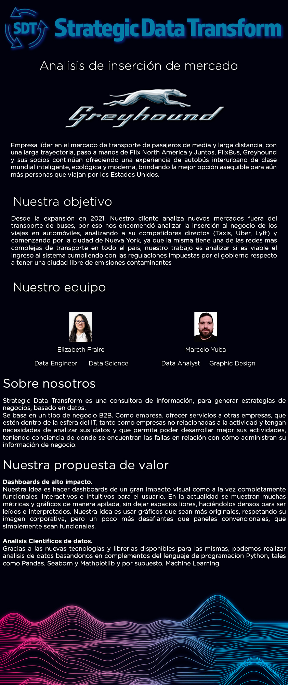

<h1><b>Stack Tecnologico</h1>

 
<h3>Estamos al corriente de las ultimas tecnologias para analisis de dato y creacion de modelos de entrenamiento de Machine Learning, para poder predecir el comportamiento de datos y asi llegar a las conclusiones pedidas por nuestro cliente, </h3>
 
 

<h1><b>Camino del dato</h1>

 

<h3>De igual manera que sobre nuestras tecnologias, queremos que nuestro cliente este al tanto de como son tratados los datos, para asi tener una mejor comprension del trabajo realizado </h3>

 
 

<h1><b>Costos de inversión y renovación</h1>

<h3>
En este apartado, analizamos los costos segun 4 criterios, tipo de combustible, autonomia y disponibilidad de recarga de electrica y por tipo de vehiculo (SUV, MINI-VAN, SUV). Se calcula tomando hasta 30 unidades por modelo como para poder comenzar a operar.
Segun las nuevas Legislaciones Nueva York no admite vehiculos a nafta dentro de la zona de congestion, al menos en lo que es transporte publico, y para 2030 directamente deben ser 100% electricos.
Por lo tanto vamos a presentar los vehiculos hibridos y electricos, con la exepcion de 2 mini-vans para el transporte de mas de 4 pasajeros.
Todos los vehiculos listados estan aprobados por la ciudad de Nueva York para transporte de pasajeros.
</h3>

  

 

<h3> Gracias a nuestra calculadora que se encuentra en <a href="https://mockupapp.streamlit.app/">Streamlit</a> podemos analizar y hacer conclusiones respecto a los modelos que creemos son las mejores opciones, estan invitados a visitar nuestra pagina de Streamlit y analizar otras opciones ademas de ver mas sobre nuestra propuesta y quienes somos.
</h3>

<h2>Nafta</h2>

<h3>Estos son los casos exepcionales que hablamos respecto a vehiculos a nafta y sin las mini vans de 7 pasajeros, dada la experiencia de nuestr cliente en el transporte de pasajeros, es logico que acapare este pedazo del negocio, principalmente para viajes desde y hacia los aeropuertos JFK y La Guardia. </h3>
<h2>Vehiculo elegido para el segmento de 7 pasajeros
</h2>
 

        

            
                        
                
                
Ford Transit Connect   Costo por unidad = $35,995.00   Costo de flota = $1,079,850.00  Autonomia = 24 MPG en ciudad Tipo de vehiculo = Mini-Van 

            

        

    

<h3>Tomando en cuenta los numeros, aconsejamos la compra de la Ford Transit Connect para el segmento de 7 pasajeros, no solo por su valor, sino por la disponibilidad de cerntros de servicio y disponibilidad de repuestos para los mantenimientos regulares, menores tiempos de reparacion, dado que muchos mecanicos tienen mas familiaridad con la marca.
</h3>
 
<h2>Hibridos</h2>

        

            
                        
                
                
Kia Niro Plug-In Hybrid   Costo por unidad = $35,165.00   Costo de flota = $1,054,950.00  Autonomia = 53 MPG en ciudad Tipo de vehiculo = SUV

            

        

    

 
<h3>Tomamos en cuenta este SUV debido a su largo alcance y bajo costo de compra, teniendo una buena red de distribudores en el pais y simpleza mecanica, ademas al ser un hibrido enchufable, puede ahorrar costos de combustible por encima de los costos de carga electrica que son mas economicos, ademas de la autogeneracion electrica que genera el motor de combustible y frenos regenerativos, Ideal para viajes de ciudad o de aeropuertos con valijas medianas a grandes, gracias a su gran volumen de carga.
</h3>

        

            
                        
                
                
Honda Accord Hibryd   Costo por unidad = $28,990.00   Costo de flota = $869,700.00  Autonomia = 29 MPG en ciudad Tipo de vehiculo = Sedan

            

        

    

<h3>El Honda Accord, es la mejor eleccion ya que tiene un buen balance precio-calidad, al igual que Toyota, la calidad y durabilidad de Honda es probada desde hace muchos años, ideal para todo tipo de viajes y mas aun en ciudad.
</h3>

        

            
                        
                
                
Toyota Sienna Hibryd  Costo por unidad = $ 39,080.00
                   Costo de flota = $1,172,400.00  Autonomia = 35 MPG en ciudad Tipo de vehiculo = Mini-Van

            

        

    

<h3>El creador de los vehiculos Hibridos, Toyota, en este caso elegimos el Sienna, por que es el mas vendido en Nueva York para el transporte de pasajeros, en su version convencional tanto como la convertida para accesibilidad (sillas de ruedas), con un precio accesible y una buena autonomia, lo que lo hace ideal para el mercado de 7 pasajeros.
</h3>

Tiempo de recuperación de inversión
Analisis de Contaminacion
Analisis de mejores Autos según autonomia
Analisis comparativo entre los 3 analizados
Disponibilidad de Estaciones de carga
Analisis del por que la reducción de contaminacion
Destinos y llegadas mas populares